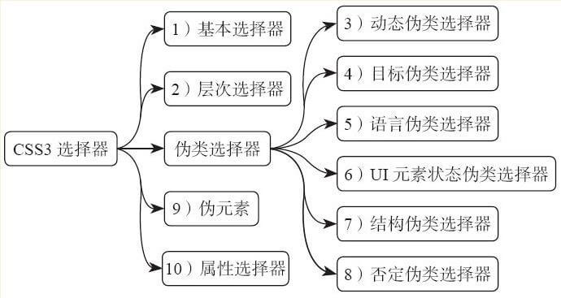

# CSS3 选择器

要使某个样式应用于特定的 **HTML** 元素，首先需要找到该元素。在 **CSS** 中，执行这一任务的表现规则称为 **CSS** 选择器。它为获取目标元素之后施加样式提供了极大的灵活性。

|                   分类                    | 子类                                                    |
| :---------------------------------------: | :------------------------------------------------------ |
|       [基本选择器](./12-1基本选择器.md)        | 通配选择器、元素选择器、ID 选择器、类选择器、群组选择器 |
|       [层次选择器](./12-2层次选择器.md)        | 后代选择器、子选择器、相邻兄弟选择器、通用选择器        |
|    [动态伪类选择器](./lesson3_3_1.md)     | E:link、E:visited、E:active、E:hover、E:focus           |
|    [目标伪类选择器](./lesson3_3_2.md)     | E:target                                                |
|    [语言伪类选择器](./lesson3_3_3.md)     | E:lang                                                  |
| [UI 元素状态伪类选择器](./lesson3_3_4.md) | E:checked、E:enabled、E:disabled                        |
|    [结构伪类选择器](./lesson3_3_5.md)     | DOM 树选择器                                            |
|    [否定伪类选择器](./lesson3_3_6.md)     | E:not                                                   |
|         [伪元素](./lesson3_4.md)          | DOM 外部的某种文档结构                                  |
|       [属性选择器](./lesson3_5.md)        | 行内属性选择器                                          |

## css优先级 

 优先级算是css中的一个非常重要的知识点，也是笔试面试中经常会考到的知识点。
  
## 一、什么是css优先级 

css优先级，即是指CSS样式在浏览器中被解析的先后顺序。 

## 二、css优先级规则 

比较简单易记的一种方法就是给不同选择器分配不同的值： 

1. id选择器默认优先级最高，其权值为100 

2. class选择器、属性选择器和伪类选择器的权值为10 

3. 标签选择器的优先级较低，其权值为1 

所以在比较样式的优先级时，只需统计选择符中的id、class、标签名个数，然后把对应的权值相加即可。根据结果便可得出优先级高低。 

1. 结果较大的优先级较高 

2. 结果相同，则后定义的样式优先级较高 

3. 如果样式值中含有!important，则该值优先级最高 