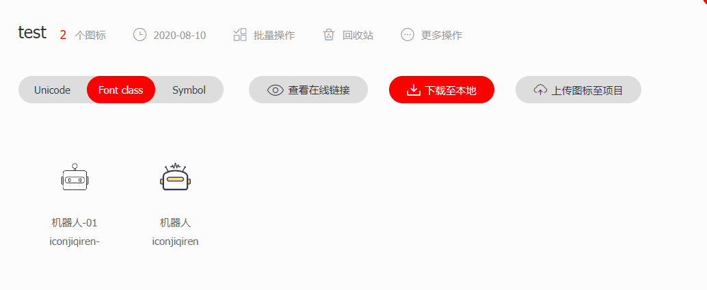

# iconfont 使用

## iconfont 使用步骤

### 1.登录 iconfont

[iconfont 图标库](https://www.iconfont.cn/)

### 2.新建一个项目

### 3.给项目添加图标

1. 搜索需要的图标，添加到购物车。
2. 在购物车中将项目需要的图标添加到项目中。点击“添加至项目”
3. 回到项目中，下载“font class”的文件到本地。

### 4.前端项目中使用 iconfont

1. 将下载下来的 iconfont 项目文件解压出来，整个文件放到项目中放置静态文件的地方。
2. 在页面中引入 iconfont.css 文件。
3. 创建一个 div 引入类名`

`,`iconfont`是固定的，`iconjiqiren`是想要的图标对应的类名。

