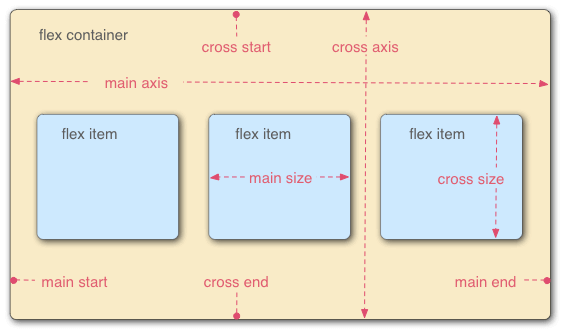
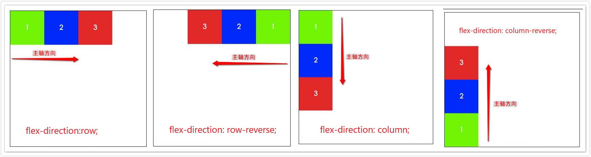
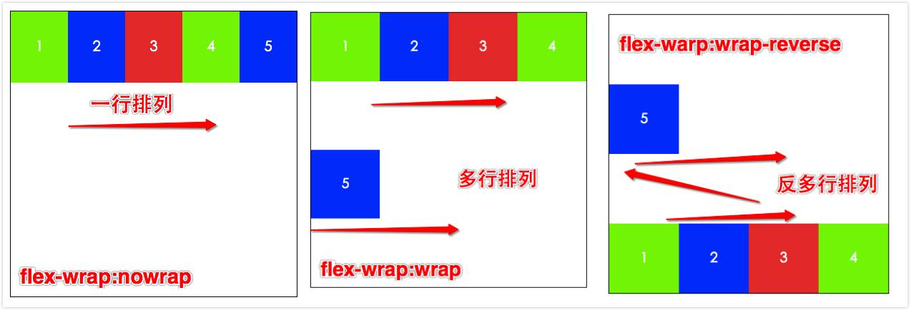
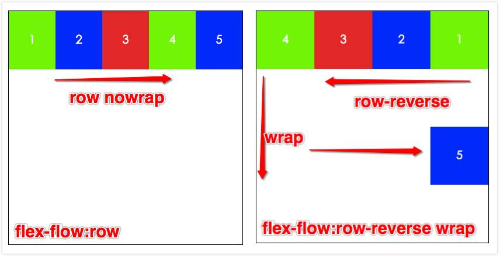
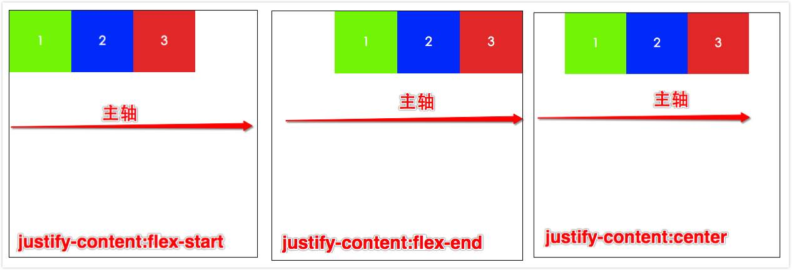
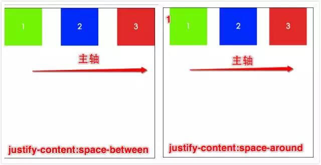
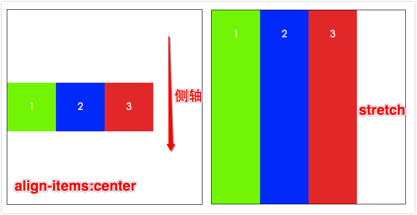
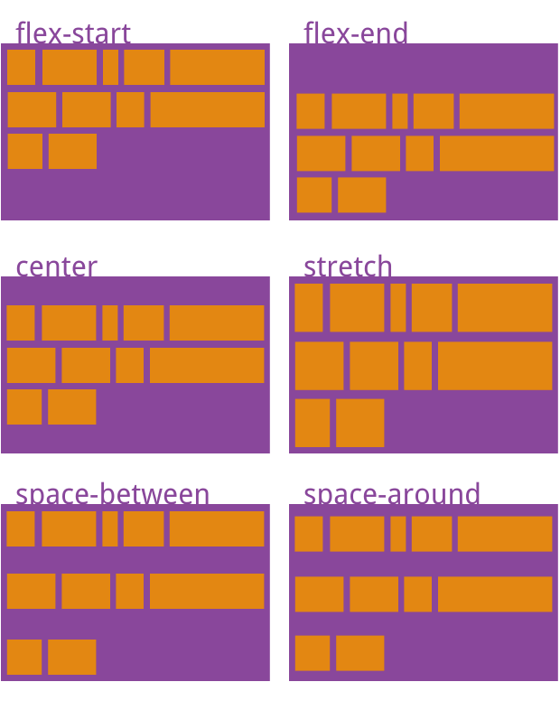

# Flexbox 弹性布局

`Flexible Box 模型`，通常被称为 `flexbox`，是一种一维的布局模型。它给 `flexbox` 的`子元素`之间提供了强大的`空间分布`和`对齐`能力。

我们说 `flexbox` 是一种一维的布局（**目前工作中最常见、最常用的布局方式**），是因为一个 `flexbox` 一次只能处理一个维度上的元素布局，一行或者一列。

作为对比的是另外一个二维布局 [网格布局 CSS Grid Layout](./18-grid网格布局.md)，可以同时处理行和列上的布局。

<!-- ## flexbox 的所有属性 -->

<!-- - flex容器
    - display
        - flex
    - flex-direction
        - row
        - row-reverse
        - column
        - column-reverse
    - flex-wrap
        - nowrap
        - wrap
        - wrap-reverse
    - flex-flow (上面两属性的复合写法)
        - [flexdirection] || [flex-wrap]
        - 默认： row  nowrap
    - justify-content
        - flex-start
        - flex-end
        - center
        - space-between
        - space-around
    - align-items
        - flex-start
        - flex-end
        - center
        - baseline
        - stretch
    - align-content
        - flex-start
        - flex-end
        - space-between
        - space-around
        - stretch
- flex项目 子元素
    - order
        - [number]
    - flex-grow
        - [number] // 默认：0
    - flex-shrink
        - [number] // 默认：1
    - flex-basis
        - [length] || auto // 默认：auto
    - flex (上面三个属性的复合写法)
        - [flex-grow] [flex-shrink] [flex-basis]
        - none: 
        - 1 :
    - align-self
        - flex-start
        - flex-end
        - space-between
        - space-around
        - stretch

 -->

首先来一张flexbox弹性布局的属性图

<iframe :src="$withBase('/markmap.html')" width="100%" height="700"></iframe>

## Flex容器

```css
display: flex;
```

采用 Flex 布局的元素，称为 Flex 容器（flex container），简称"`容器`"。它的所有直系子元素自动成为容器成员，称为 Flex 项目（flex item），简称"`项目`"。

**意思就是：当我们想使用flexbox弹性布局时候，首先要先给元素的display值设置为`flex`（块级）或者`inline-flex`（行内级）。**

完成这一步之后，容器中的**直系子元素**就会变为 **flex 元素**。

这时flex容器，和子元素（项目）的CSS属性都会有一个初始值，所以 flex 容器中的所有 flex 元素都会有下列行为：

- 元素排列为一行 (flex-direction 属性的初始值是 row)。
- 元素从主轴的起始线开始。
- 元素不会在主维度方向拉伸，但是可以缩小。 (flex-grow: 0; flex-shrink: 1;)
- flex-basis 属性为 auto。
- flex-wrap 属性为 nowrap。

<iframe height="400" style="width: 100%;" scrolling="no" title="Untitled" src="https://codepen.io/347830076/embed/zYEeMMd?default-tab=html%2Cresult&theme-id=dark" frameborder="no" loading="lazy" allowtransparency="true" allowfullscreen="true">
  See the Pen <a href="https://codepen.io/347830076/pen/zYEeMMd">
  Untitled</a> by cylyiou (<a href="https://codepen.io/347830076">@347830076</a>)
  on <a href="https://codepen.io">CodePen</a>.
</iframe>

## flexbox 的两根轴线

当使用 `flex` 布局时，首先想到的是两根轴线 — `主轴`和`交叉轴`。主轴由 `flex-direction` 定义，另一根轴垂直于它。

我们使用 `flexbox` 的所有属性都跟这两根轴线有关, 所以有必要在一开始首先理解它。




容器默认存在两根轴：水平的主轴（`main axis`）和垂直的交叉轴（`cross axis`）。主轴的开始位置（与边框的交叉点）叫做`main start`，结束位置叫做`main end`；交叉轴的开始位置叫做`cross start`，结束位置叫做`cross end`。

项目默认沿主轴排列。单个项目占据的主轴空间叫做`main size`，占据的交叉轴空间叫做`cross size`。

当使用了这个值以后，伸缩容器会为内容建立新的伸缩格式化上下文（`FFC`），它的上下文展示效果和`BFC`元素相同（BFC特性：独立空间，浮动元素不会影响伸缩容器的元素，且伸缩容器的边界不会与其内容边界叠加）。


**注意，设为 Flex 布局以后，子元素的float、clear和vertical-align属性将失效。**


<p>伸缩容器不是块容器，因此有些设计用来控制块布局的属性，在伸缩布局中不适用，特别是多栏（column)，float，clear，vertical-align这些属性。</p>

## 容器的6个属性

- [flex-direction (主轴的方向)](#flex-direction)
- [flex-wrap (控制容器单行还是多行)](#flex-wrap)
- [flex-flow (主轴和交叉轴复合写法)](#flex-flow)
- [justify-content (项目在主轴的对齐方式)](#justify-content)
- [align-items (项目在交叉轴的对齐方式)](#align-items)
- [align-content (伸缩行在伸缩容器里的对齐方式)](#align-content)

### flex-direction

flex-direction属性用来控制`伸缩容器中主轴的方向`，同时也决定了`伸缩项目的方向`。

- **flex-direction: `row`;** (默认值)   主轴的方向和正常的方向一样，**从左到右排列**。
- **flex-direction: `row-reverse`;**    和row的方向相反，**从右到左排列**。
- **flex-direction: `column`;**         **从上到下排列**。
- **flex-direction: `column-reverse`;** **从下到上排列**。

```css
flex-direction:row;
```

网页展示效果如下：



### flex-wrap

`flex-wrap`属性控制伸缩**容器是单行还是多行**，也决定了交叉轴方向。

- flex-wrap: `nowrap`; 伸缩容器**单行显示** (默认值)；
- flex-wrap: `wrap`;   伸缩容器**多行显示**；伸缩项目每一行的排列顺序由**上到下**依次排列。
- flex-wrap: `wrap-reverse`; 伸缩容器**多行显示**，但是伸缩项目每一行的排列顺序由**下到上**依次排列。

```css
flex-wrap: wrap;
```

网页效果见图；



### flex-flow 

`flex-flow` 属性为 **flex-direction**（主轴方向）和 **flex-wrap**（交叉轴方向）的缩写，两个属性决定了伸缩容器的主轴与交叉轴。


```
flex-flow: [flex-direction] [flex-wrap]; 默认值为row nowrap
flex-flow: row;
flex-flow: row-reverse wrap;
```


举两个栗子：

- `flex-flow:row;` 也是默认值；主轴是行内方向(**左到右**)，**单行显示**，不换行；

- `flex-flow:row-reverse wrap;` 主轴和行内方向相反，**从右到左**，项目每一行由**上到下**排列（交叉轴）。


<p>网页效果如下：</p>



>这里大家可以多动手自己去试试不同的组合，在浏览器感受下效果。

### justify-content

`justify-content` 用于定义`伸缩项目在主轴上面的对齐方式`，当一行上的所有伸缩项目都不能伸缩或可伸缩但是已经达到其最大长度时，这一属性才会对多余的空间进行分配。当项目溢出某一行时，这一属性也会在项目的对齐上施加一些控制。

- justify-content: `flex-start;`（默认值） 伸缩项目向主轴的起始位置开始对齐，后面的每元素紧挨着前一个元素对齐`（左对齐）`。
- justify-content: `flex-end;` 伸缩项目向主轴的结束位置对齐，前面的每一个元素紧挨着后一个元素对齐。`（右对齐）`
- justify-content: `center;` 伸缩项目相互对齐并在主轴上面处于居中，并且第一个元素到主轴起点的距离等于最后一个元素到主轴终点的位置。`(居中对齐)`
- justify-content: `space-between;` 伸缩项目平均的分配在主轴上面，并且第一个元素和主轴的起点紧挨，最后一个元素和主轴上终点紧挨，中间剩下的伸缩项目在确保`两两间隔相等`的情况下进行平分。
- justify-content: `space-evenly`; flex项都沿着主轴均匀分布在指定的对齐容器中。相邻flex项之间的间距，主轴起始位置到第一个flex项的间距,，主轴结束位置到最后一个flex项的间距，都完全一样。
- justify-content: `space-around;` 伸缩项目平均的分布在主轴上面，并且第一个元素到主轴起点距离和最后一个元素到主轴终点的距离相等，且等于中间元素两两的间距的一半。

<p>来个demo理解起来快一点：</p>





### align-items

`align-items` 用来定义伸缩**项目在交叉轴的对齐方式**，这类似于**justify-content**属性，是交叉轴方向。

- `align-items: flex-start;` 伸缩项目在交叉轴起点边的外边距紧靠住该行在交叉轴起点的边。`(上对齐)`
- `align-items: flex-end;`   伸缩项目在交叉轴终点边的外边距靠住该行在交叉轴终点的边。`(下对齐)`
- `align-items: center;`     伸缩项目的外边距在交叉轴上居中放置。`(居中对齐)`
- `align-items: stretch;`    伸缩项目拉伸填充整个伸缩容器。`（充满容器）`
- `align-items: baseline;`   所有元素向`基线对齐`

下面demo只展示 `center` 和 `stretch` 的栗子，其他几个值，自己动手试试看效果。</p>



**flex-directo** 和 **flex-wrap** 是一对，**justify-content** 和 **align-items** 是一对，前者分别定义主轴和交叉轴的方向，后者分别定义主轴和交叉轴中项目的对齐方式
### align-content

`align-content` 属性用来定义`伸缩行在伸缩容器里的对齐方式`，这与调准伸缩项目在主轴上对齐方式的**justify-content**属性类似。只不过这里元素是以**一行为单位**。

请注意本属性在只有一行的伸缩容器上没有效果。当使用flex-wrap:wrap时候多行效果就出来了。
- align-content: `start`; 所有行从容器的起始边缘开始填充。
- align-content: `end`; 所有行从容器的结束边缘开始填充。
- align-content: `flex-start`; 所有行从垂直轴起点开始填充。第一行的垂直轴起点边和容器的垂直轴起点边对齐。接下来的每一行紧跟前一行。
- align-content: `flex-end`; 所有行从垂直轴末尾开始填充。最后一行的垂直轴终点和容器的垂直轴终点对齐。同时所有后续行与前一个对齐。
- align-content: `center`; 所有行朝向容器的中心填充。每行互相紧挨，相对于容器居中对齐。容器的垂直轴起点边和第一行的距离相等于容器的垂直轴终点边和最后一行的距离。
- align-content: `stretch`; 拉伸所有行来填满剩余空间。剩余空间平均地分配给每一行。
- align-content: `space-between`; 所有行在容器中平均分布。相邻两行间距相等。容器的垂直轴起点边和终点边分别与第一行和最后一行的边对齐。
- align-content: `space-around`;  所有行在容器中平均分布，相邻两行间距相等。容器的垂直轴起点边和终点边分别与第一行和最后一行的距离是相邻两行间距的一半。
- align-content: `space-evenly`;  所有行沿垂直轴均匀分布在对齐容器内。每对相邻的项之间的间距，主开始边和第一项，以及主结束边和最后一项，都是完全相同的。



## Flex项目 (子元素的属性)

终于写到关于伸缩项目（子元素）的相关属性了

- [flex-grow (项目的放大比例)](#flex-grow )
- [flex-shrink (项目的缩小比例)](#flex-shrink)
- [flex-basis (项目的大小)](#flex-basis)
- [flex（flex-grow，flex-shrink，flex-basis的组合）](#flex)
- [order (项目的排列顺序)](#order)
- [align-self (项目上覆写align-item的对齐方式)](#align-self)

### flex-grow

- `flex-grow` 属性定义**项目的放大比例**，**默认为0**，即如果存在剩余空间，也不放大。
- 如果所有项目的flex-grow属性都为1，则它们将**等分**剩余空间（如果有的话）。如果一个项目的flex-grow属性为2，其他项目都为1，则前者占据的剩余空间将比其他项多一倍。

### flex-shrink

- `flex-shrink` 属性定义了**项目的缩小比例**，**默认为1**，即如果**空间不足**，该项目将**缩小**。
- flex-shrink属性为0时，项目不缩小
- 如果所有项目的flex-shrink属性都为1，当空间不足时，都将**等比例缩小**。如果一个项目的flex-shrink属性为0，其他项目都为1，则空间不足时，前者不缩小。
### flex-basis属性

`flex-basis` 它的默认值为auto，即 flex 项目元素在主轴方向上的初始大小。

它可以设为固定值（比如350px），则项目将`占据固定空间`。

> flex-grow 、flex-shrink 、flex-basis 这三个属性，负值是不允许的。

### flex

`flex` 属性是`flex-grow（放大比例）`,`flow-shrink（收缩比例）`,`flex-basis（伸缩基准值）`这个三个属性的缩写写法，建议大家采用缩写的方式而不是单独来使用这3个属性。

```css
flex: 0;
flex: 1;
flex: none; // (0 0 auto)
flex: auto; // (1 1 auto)
```

- `flex-grow` 是必须的  `flex-shrink` 和 `flow-basis` 是可选的
- `flex-grow` 其中number作为**放大比例**，没有单位，初始值是0，主要用来决定伸缩容器剩余空间按比例应扩展多少空间。
- `flex-shrink` 其中number作为**收缩比例**，没有单位，初始值是1，也就是 flex 项目元素仅在默认**宽度之和大于容器**的时候才会发生收缩
- `flex-basis: auto;` 默认是`auto`也就是根据可伸缩比率计算出剩余空间的分布之前，伸缩项目主轴长度的起始数值。若在「flex」缩写省略了此属性，则**flex-basis**的指定值是长度0。
- `flex` 属性是 `flex-grow` , `flex-shrink` 和 `flex-basis` 的简写，默认值为`0 1 auto`。后两个属性可选。该属性有两个快捷值：
    - flex: **auto**; (1 1 auto)
    - flex: **none**; (0 0 auto)。

建议优先使用这个属性，而不是单独写三个分离的属性，因为浏览器会推算相关值。
### order

**属性定义项目的排列顺序。数值越小，排列越靠前，默认为0。**

有一种用法比较多，想设置一组中有两个元素一个排第一，另外一个排最后，主需要将第一个的 **order: -1;** 另一个为 **order: 1;** 这样就好了。

譬如我们想控制一个容器中有4个box，想box4为第一个显示，box1为最后一个显示。只需要这样

<iframe height="500" style="width: 100%;" scrolling="no" title="css 弹性布局order" src="https://codepen.io/347830076/embed/QWNqYbQ?height=265&theme-id=dark&default-tab=html,result" frameborder="no" loading="lazy" allowtransparency="true" allowfullscreen="true">
  See the Pen <a href='https://codepen.io/347830076/pen/QWNqYbQ'>css 弹性布局order</a> by cylyiou
  (<a href='https://codepen.io/347830076'>@347830076</a>) on <a href='https://codepen.io'>CodePen</a>.
</iframe>


### align-self

`align-self` 用来在单独的**伸缩项目上覆写align-item的对齐方式**，这个属性是用来覆盖伸缩容器属性 `align-items` 对每一行的对齐方式。也就是说在默认的情况下这两个值是相等的。

- align-self: `auto`; （默认值） 设置为父元素的 align-items 值。
- align-self: `flex-start`; flex 元素会对齐到 cross-axis 的首端。
- align-self: `flex-end`;   flex 元素会对齐到 cross-axis 的尾端。
- align-self: `center`;     flex 元素会对齐到 cross-axis 的中间，如果该元素的 cross-size 尺寸大于 flex 容器，将在两个方向均等溢出。
- align-self: `baseline`; 基线对齐
- align-self: `stretch`;  伸缩项目拉伸填充整个伸缩容器
