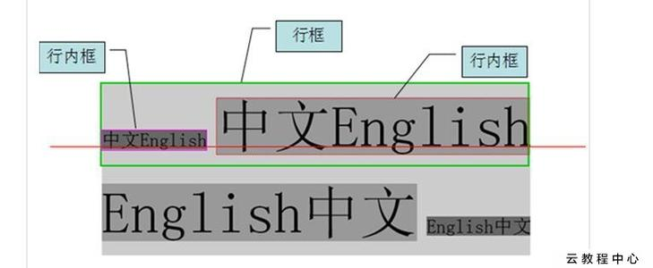
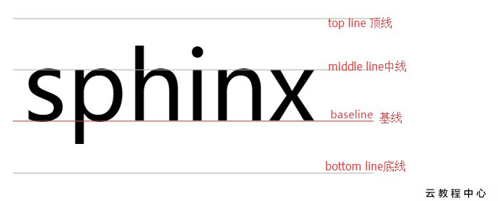

# 文字样式

## font 字体

### font-size 字体大小

**语法：`font-size: 长度单位`**

**单位：推荐使用px像素单位**

| 绝对长度单位 | 说明                                             |
| :----------- | :----------------------------------------------- |
| px           | 像素（Pixels）。                                 |
| cm           | 厘米（Centimeters）。                            |
| mm           | 毫米（Millimeters）。                            |
| 相对长度单位 | 说明                                             |
| em           | 相对于当前对象内文本的字体尺寸。                 |
| rem          | 相对于根元素(即 html 元素)font-size 计算值的倍数 |
| vw           | 相对于视口的宽度。视口被均分为 100 单位的 vw     |
| vh           | 相对于视口的高度。视口被均分为 100 单位的 vh     |

```cs
    font-size: 10px;
    font-size: 10cm;
    font-size: 10mm;
    font-size: 10em;
    font-size: 10rem;
    font-size: 10vw;
    font-size: 10vh;
```

## font-family 字体

**语法：`font-family: 黑体, 宋体, 楷体, helvetica, verdana, 'sans-serif'`**  
**可同时指定多个字体，中间以逗号隔开，表示如果浏览器不支持第一个字体，则会尝试下一个，直到找到合适的字体， 如果都没有，则以我们电脑默认的字体为准.**

```cs
font-family: 黑体, 宋体, 楷体, helvetica, verdana, 'sans-serif';
```

## font-weight 字体粗细

**语法：`font-weight: normal | bold | bolder | lighter | integer`**

- normal: 正常的字体。相当于数字值 400
- bold: 粗体。相当于数字值 700。
- bolder：定义比继承值更重的值
- lighter：定义比继承值更轻的值
- integer: 用数字表示文本字体粗细。取值范围：100 | 200 | 300 | 400 | 500 | 600 | 700 | 800 | 900

```cs
font-weight: bold;
```

## font-style 字体是否倾斜

**语法：`font-style: normal | italic | oblique;`**

- normal: 正常的字体
- italic：`斜体`，如果当前字体没有可用的斜体版本，会选用倾斜体（`oblique` ）替代
- oblique：`倾斜体`，如果当前字体没有可用的倾斜体版本，会选用斜体（`italic` ）替代

```cs
font-style: italic;
```

## font 属性复合写法

**语法： `font: font-style font-weight font-size/line-height font-family;`**

- 使用 font 属性参数必须按照如上的排列顺序，且 font-size 和 font-family 是必写的。每个参数仅允许有一个值。忽略的将使用其参数对应的独立属性的默认值。

```cs
    font: normal bold 30px/50px Times;
```

## color 颜色

**语法：`color: <color>`**

| 表示             | 属性值                           |
| ---------------- | -------------------------------- |
| 预定义的颜色值   | red，green，blue                 |
| 十六进制（推荐） | #FFFFFF（可简写#FFF）               |
| RGB 代码         | rgb(255, 0, 0)或 rgb(100%, 0%, 0%) |
| RGBA 代码         | rgbaa(255, 0, 0, 0.5)或 rgba(100%, 0%, 0%, 0.5) |

```cs
    color: red;
    color: #ff0;
    color: #FFFF00;
    color: rgb(255, 0, 0);
    color: rgba(255, 0, 0, 0.5);
```

## text-align 水平对齐方式

**语法：`text-align: left;`**

**属性值：**

- left: 内容左对齐
- right：内容右对齐
- center：内容居中对齐
- justify：内容两端对齐，但对于强制打断的行（被打断的这一行）及最后一行（包括仅有一行文本的情况，因为它既是第一行也是最后一行）不做处理。（CSS3）
- start：内容对齐开始边界。
- end：内容对齐结束边界。（CSS3）
- justify-all：效果等同于 justify，不同的是最后一行也会两端对齐。（CSS3）
- match-parent：这个值和 inherit 表现一致，只是该值继承的 start 或 end 关键字是针对父母的 direction 值并计算的，计算值可以是 left 和 right 。（CSS3）

```cs
text-align: center;
```

## line-height 行间距

**语法：line-height: normal | length | percentage | number**

**属性值：**

- normal：默认。设置合理的行间距。
- length：设置固定的行间距。
- percentage：用百分比指定行高，其百分比基于文本的 font-size 进行换算。不允许负值。
- number： 	设置数字，此数字会与当前的字体尺寸相乘来设置行间距。

```cs
    line-height: 50px;
    line-height: 2;
```

## text-indent 首行缩进

**语法：`text-indent：2em;`**
```cs
body{
    text-indent: 2em;
}
```


## text-decoration 装饰

**语法：`text-decoration: text-decoration-line || text-decoration-style || text-decoration-color;`**


#### text-decoration-line

**定义元素文本装饰线条位于文本的哪个位置。**

**语法：`text-decoration-line：none | [ underline || overline || line-through || blink ]`**

**属性值：**

- none：指定文字无装饰
- underline：指定文字的装饰是下划线
- overline：指定文字的装饰是上划线
- line-through：指定文字的装饰是贯穿线
<!-- - blink：指定文字的装饰是闪烁。 -->

```cs
text-decoration-line: underline;
```

#### text-decoration-style

**定义元素文本装饰线条的形状。**

**语法：`text-decoration-style：solid | double | dotted | dashed | wavy`**

**属性值：**

- solid：实线
- double：双线
- dotted：点状线条
- dashed：虚线
- wavy：波浪线

```cs
text-decoration-style: solid;
```

#### text-decoration-color

**指定元素文本装饰线条的颜色。**

**语法：`text-decoration-color: <color>`**

```cs
text-decoration-color: red;
```

## text-shadow 阴影

**语法**
```cs
text-shadow: h-shadow v-shadow blur color;
```
注意： text-shadow属性连接一个或更多的阴影文本。属性是阴影，指定的每2或3个长度值和一个可选的颜色值用逗号分隔开来。

- h-shadow 	必需。水平阴影的位置。允许负值。
- v-shadow 	必需。垂直阴影的位置。允许负值。
- blur 	可选。模糊的距离。
- color 	可选。阴影的颜色。参阅 CSS 颜色值。

```cs
   text-shadow: 2px 2px #ff0000;
```

## text-transform 转换

**定义元素的文本如何转换大小写。**

**语法： `text-transform：none | capitalize | uppercase | lowercase | full-width`**

**属性值：**

- none：无转换
- capitalize：将每个单词的第一个字母转换成大写
- uppercase：将每个单词转换成大写
- lowercase：将每个单词转换成小写

```cs
    text-transform: capitalize;
```

## white-space 处理空白

**设置如何处理元素内的空白。**

**语法：`white-space：normal | pre | nowrap | pre-wrap | pre-line`**

**属性值：**

- normal：默认处理方式。会将序列的空格合并为一个，内部是否换行由换行规则决定。
- pre：原封不动的保留你输入时的状态，空格、换行都会保留，并且当文字超出边界时不换行。等同 pre 元素效果
- nowrap：与 normal 值一致，不同的是会强制所有文本在同一行内显示。
- pre-wrap：与 pre 值一致，不同的是文字超出边界时将自动换行。
- pre-line：与 normal 值一致，但是会保留文本输入时的换行。

## word-break 换行处理

**规定自动换行的处理方法。**

**语法：`word-break：normal | keep-all | break-all | break-word`**

**属性值：**

- normal：默认的换行规则。依据各自语言的规则，允许在字间发生换行。
- keep-all：对于 CJK（中文，韩文，日文）文本不允许在字符内发生换行。Non-CJK 文本表现同 normal
- break-all：对于 Non-CJK 文本允许在任意字符内发生换行。该值适合包含一些非亚洲文本的亚洲文本，比如使连续的英文字符断行。
- break-word：与 break-all 相同，不同的地方在于它要求一个没有断行破发点的词必须保持为一个整体单位。这与 word-wrap 的 break-word 值效果相同

```cs
word-break: break-word;
```

## letter-spacing 字间隔

- normal 	默认。规定字符间没有额外的空间。
- length 	定义字符间的固定空间（允许使用负值）。
- inherit 	规定应该从父元素继承 letter-spacing 属性的值。

```cs
    letter-spacing: 10px;
```

## word-spacing 单词间隔

**增加或减少单词间的空白（即单词间隔）。**

**语法：`word-spacing：normal | <length> | <percentage>`**

**属性值：**

- normal：默认间隔。计算值为 0
- `<length>`：用长度值指定单词间隔。可以为负值。
- `<percentage>`：用百分比指定单词间隔。可以为负值。（CSS3）

```cs
    word-spacing: 10px;
```


## vertical-align 内联级元素与 table-cell 元素 垂直对齐方式





### 定义行内元素在行框内的垂直对齐方式。

### 适用于：内联级元素与 table-cell 元素

- baseline 	默认。元素放置在父元素的基线上。
- sub 	垂直对齐文本的下标。
- super 	垂直对齐文本的上标
- top 	把元素的顶端与行中最高元素的顶端对齐
- text-top 	把元素的顶端与父元素字体的顶端对齐
- middle 	把此元素放置在父元素的中部。
- bottom 	使元素及其后代元素的底部与整行的底部对齐。
- text-bottom 	把元素的底端与父元素字体的底端对齐。
- length 	将元素升高或降低指定的高度，可以是负数。
- % 	使用 "line-height" 属性的百分比值来排列此元素。允许使用负值。
- inherit 	规定应该从父元素继承 vertical-align 属性的值。

```cs
    vertical-align: middle;
```

每个行框内的基线如何确定
- 1.没有任何文本时，基线就是margin的下边界
- 2.如果盒子内部有文本，则以文本的baseline作为基线
- 3.如果设置overflow不为visible，则基线改为margin下边界

vertical-align:
baseline: 把当前盒的基线与父级盒的基线对齐。如果该盒没有基线，就将底部外边距的边界和父级的基线对齐
middle：把当前盒的垂直中心和父级盒的基线加上父级的半x-height对齐
top：将子盒子和行框内 的顶部对齐
bottom: 将子盒子和行框内 的底部对齐

注意：vertical-align 是设置给子元素，而不是父元素，他设置的是子元素的相对于爸爸基线的对齐方式

```html
<!DOCTYPE html>
<html lang="en">
<head>
    <meta charset="UTF-8">
    <meta name="viewport" content="width=device-width, initial-scale=1.0">
    <title>vertical-align</title>
    <style>
        .parent{
            background-color: #ccc;
        }
        .son1,.son2{
            display: inline-block;
            vertical-align: middle;
            width: 100px;
            height: 100px;
            margin: 10px;
            background-color: #f00;
        }
        .son1{
            margin-bottom: 200px;
        }
    </style>
</head>
<body>
    <div class="parent">
        <div class="son1">x</div>
        <div class="son2"></div>
    </div>
</body>
</html>
```
