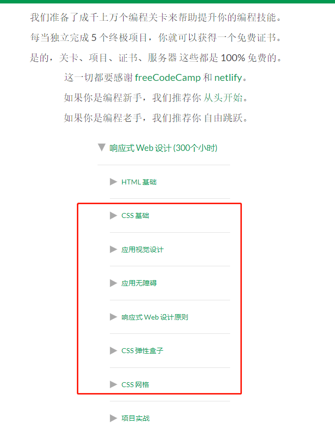
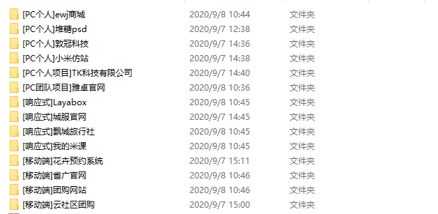

# 实战项目练习

## 练习

大家通过多做练习，实战运用每个知识点，就能学以致用了。

利用零碎时间刷刷题，能把学到的知识运用起来，也能巩固基础知识。

### <a href="https://www.runoob.com/quiz/css-quiz.html" target="_blank" style="color:red">菜鸟css测试练习</a>

### <a href="https://learn.freecodecamp.one/" target="_blank" style="color:red">css 基础练习</a>

大家把红色框框的css内容都刷了，css基础也基本没啥问题了。

## 项目

### 大家挑选来做，pc端，移动端，响应式最少各一个项目。

百度网盘链接：https://pan.baidu.com/s/1MyHfUYVOF5OiYdO12IdCmg 

提取码：bluj

通过实战完整静态项目，来综合运用所学的知识。实战实战实战，这些就是平时前端开发的内容，程序员，就是要多敲代码，亲自敲代码的时候，运行起来在页面看效果，才会遇到各种各样的问题， 遇到问题就去解决问题， 反复如此，这就是积累经验的过程。一步一步成长为大神。加油加油！！！