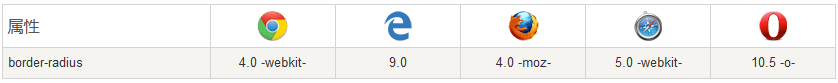

# Border（边框）

## 语法
```cs
border: border-width  border-style  border-color;
```
## 边框的粗细（border-width）

```cs
border-width: 默认值 2.4px | 5px | 5em | 5rem;
```
- 不能用`%`作为单位，不生效

## 边框的类型（border-style）

- 默认值是`none`，所以他是边框属性的必填项

- 边框类型的属性值：

- none: 默认无边框
- dotted: 定义一个点线边框
- dashed: 定义一个虚线边框
- solid: 定义实线边框
- double: 定义两个边框。 两个边框的宽度和 border-width 的值相同
- groove: 定义3D沟槽边框。效果取决于边框的颜色值
- ridge: 定义3D脊边框。效果取决于边框的颜色值
- inset:定义一个3D的嵌入边框。效果取决于边框的颜色值
- outset: 定义一个3D突出边框。 效果取决于边框的颜色值

<iframe height="700" style="width: 100%;" scrolling="no" title="css 边框" src="https://codepen.io/347830076/embed/VwazwxR?height=265&theme-id=dark&default-tab=html,result" frameborder="no" loading="lazy" allowtransparency="true" allowfullscreen="true">
  See the Pen <a href='https://codepen.io/347830076/pen/VwazwxR'>css 边框</a> by cylyiou
  (<a href='https://codepen.io/347830076'>@347830076</a>) on <a href='https://codepen.io'>CodePen</a>.
</iframe>

## 边框的颜色（border-color）

    border-color: #000000 | rgb(0,0,0) | rgba(0,0,0,.5) | transparent | inherit;

## 边框-单独设置各边

- 如果需要给四个方向的边框设置不同的样式的时候要用到`border-top`、`border-right`、`border-bottom`、`border-left`

```cs
div{
    border-top-style:dotted;
    border-right-style:solid;
    border-bottom-style:dotted;
    border-left-style:solid;
}
```

#### border-style属性可以有1-4个值：

- border-style:dotted solid double dashed;
    - 上边框是 dotted
    - 右边框是 solid
    - 底边框是 double
    - 左边框是 dashed

- border-style:dotted solid double;
    - 上边框是 dotted
    - 左、右边框是 solid
    - 底边框是 double

- border-style:dotted solid;
    - 上、底边框是 dotted
    - 右、左边框是 solid
- border-style:dotted;
    - 四面边框是 dotted

**其他属性同理**

### 边框-简写属性

上面的例子用了很多属性来设置边框。

你也可以在一个属性中设置边框。

你可以在"border"属性中设置：
```cs
border-width
border-style (required)
border-color
```
```cs
border: 5px solid red;
```

## 轮廓(外边框) outline

属性定义及使用说明

outline（轮廓）是绘制于元素周围的一条线，位于边框边缘的外围，可起到突出元素的作用。

outline简写属性在一个声明中设置所有的轮廓属性。

可以设置的属性分别是（按顺序）：outline-color, outline-style, outline-width

如果不设置其中的某个值，也不会出问题，比如 outline:solid #ff0000; 也是允许的。

- outline-color 	规定边框的颜色。参阅：outline-color 中可能的值。
- outline-style 	规定边框的样式。参阅：outline-style 中可能的值。
- outline-width 	规定边框的宽度。参阅：outline-width 中可能的值。
- inherit 	规定应该从父元素继承 outline 属性的设置。

```cs
p {
	border:1px solid red;
	outline:green dotted thick;
}
```


## css3 圆角 border-radius

浏览器支持

表格中的数字表示支持该属性的第一个浏览器版本号。

紧跟在 -webkit-, -ms- 或 -moz- 前的数字为支持该前缀属性的第一个浏览器版本号



#### 语法
    border-radius: 1-4 length|% / 1-4 length|%;

注意: 每个半径的四个值的顺序是：左上角，右上角，右下角，左下角。

在div中添加圆角元素：
```cs
div{
    border:2px solid;
    border-radius:25px;
    -webkit-border-radius: 25px;
    -ms-border-radius: 25px;
    -moz-border-radius: 25px;
} 
```

## css3 盒阴影 box-shadow

#### 语法

    box-shadow: h-shadow v-shadow blur spread color inset;

注意：boxShadow 属性把一个或多个下拉阴影添加到框上。该属性是一个用逗号分隔阴影的列表
- h-shadow 	必需的。水平阴影的位置。允许负值
- v-shadow 	必需的。垂直阴影的位置。允许负值
- blur 	可选。模糊距离
- spread 	可选。阴影的大小
- color 	可选。阴影的颜色。在CSS颜色值寻找颜色值的完整列表
- inset 	可选。从外层的阴影（开始时）改变阴影内侧阴影

```cs
div{
    box-shadow: 10px 10px 5px #888888;
    -webkit-box-shadow: 10px 10px 5px #888888;
    -ms-box-shadow: 10px 10px 5px #888888;
    -moz-box-shadow: 10px 10px 5px #888888;
} 
```

## css3图片边框 border-image

#### 语法
    border-image: source slice width outset repeat|initial|inherit;

- border-image-source 	用于指定要用于绘制边框的图像的位置
- border-image-slice 	图像边界向内偏移
- border-image-width 	图像边界的宽度
- border-image-outset 	用于指定在边框外部绘制 border-image-area 的量
- border-image-repeat 	用于设置图像边界是否应重复（repeat）、拉伸（stretch）或铺满（round）。

```cs
div{
    border-style: solid;
    border-width: 50px;
    border-image-source: url(../img/border.jpg);
    border-image-slice: 85;
    border-image-width: 1;
    border-image-repeat: round;
} 
```

[参考链接](https://www.w3.org/TR/css-backgrounds-3/#border-images)
