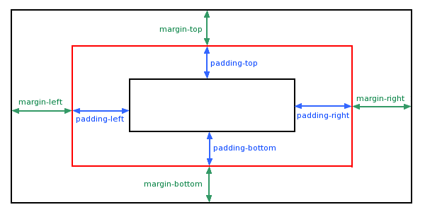

# 边距

## margin 外边距

`margin` 属性为给定元素设置四个（上下左右）方向的外边距属性。

也就是 `margin-top`，`margin-right`，`margin-bottom`，和 `margin-left` 四个外边距属性设置的简写。

```css
margin: 100px;
```

### margin - 单边外边距属性

```css
margin-top:100px;
margin-bottom:100px;
margin-right:50px;
margin-left:50px;
```

### margin - 简写属性

margin 属性接受 `1~4` 个值。值的单位可以是 `px` `em` `rem` `%` `auto` `负数`, 取值`为负`时元素会比原来更接近临近元素。

- 当只指定`一个值`时，该值会统一应用到全部四个边的外边距上。

```css
margin:25px; /* 所有的4个边距都是25px */
```

- 指定`两个值`时，第一个值会应用于上边和下边的外边距，第二个值应用于左边和右边。

```css
margin:25px 50px; /* 上下边距为25px  左右边距为50px */
```
- 指定`三个值`时，第一个值应用于上边，第二个值应用于右边和左边，第三个则应用于下边的外边距。

```css
margin:25px 50px 75px; /* 上边距为25px 左右边距为50px 下边距为75px */
```

- 指定`四个值`时，依次（顺时针方向）作为上边，右边，下边，和左边的外边距。

```css
margin:25px 50px 75px 100px; /* 上边距为25px 右边距为50px 下边距为75px 左边距为100px*/
```
为了缩短代码，有可能使用一个属性中margin指定的所有边距属性。这就是所谓的简写属性。

### `margin` 值为 `auto` 时 

让浏览器自己选择一个合适的外边距。有时，在一些特殊情况下，该值可以使`元素居中`。

```css
margin: auto; /* 上边和下边：无外边距   水平方向居中 */
```

```css 
margin: 10px auto; /* 上边和下边：10px   水平方向居中 */
```

### 外边距重叠

上下元素的下上外边距有时会重叠，实际空出的空间长度变为两外边距中的较长值

<iframe height="500" style="width: 100%;" scrolling="no" title="Untitled" src="https://codepen.io/347830076/embed/ZEJLGEL?default-tab=html%2Cresult" frameborder="no" loading="lazy" allowtransparency="true" allowfullscreen="true">
  See the Pen <a href="https://codepen.io/347830076/pen/ZEJLGEL">
  Untitled</a> by cylyiou (<a href="https://codepen.io/347830076">@347830076</a>)
  on <a href="https://codepen.io">CodePen</a>.
</iframe>

## padding 内边距（填充）

CSS `padding`（填充）是一个简写属性，定义元素边框与元素内容之间的空间，即`上下左右`的内边距。



```cs
padding-top:25px;
padding-bottom:25px;
padding-right:50px;
padding-left:50px;
```

#### 简写属性同 margin