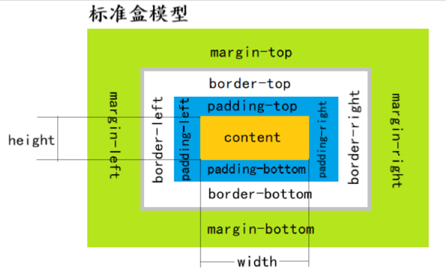
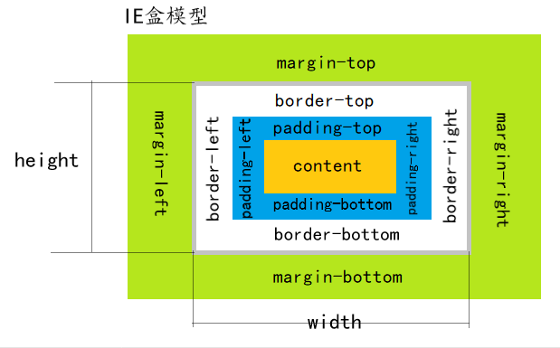

# 盒子模型

所有HTML元素可以看作盒子，在CSS中，"box model"这一术语是用来设计和布局时使用。

CSS盒模型本质上是一个盒子，它包括：`外边距`，`边框`，`内边距`，和`实际内容`。

下面的图片说明了盒子模型(Box Model)：


- `margin (外边距)` - 边框外的区域，外边距是透明的。
- `border (边框)` - 围绕在内边距和内容外的边框。
- `padding (内边距)` - 内容周围的区域，内边距是透明的。
- `content (内容)` - 盒子的内容，显示文本或其他元素。


## 标准盒子模型(W3C 标准盒模型)



W3C标准盒子模型中`width`指的是内容区域content的宽度，`height`指的是内容区域区域content的高度。

width = 内容区域的宽度   

height = 内容区域的高度

W3C标准盒子模型的总宽 =` width + 左右内边距（padding） + 左右边框(border) + 左右外边距（margin）`

W3C标准盒子模型的总高 =` height + 上下内边距（padding） + 上下边框(border) + 上下外边距（margin）`

设置标签成W3C 标准盒模型的css属性 如下：

```cs
box-sizing: content-box;
```

**这个模型个人不推荐使用，因为当设置元素宽高为100%的时候，如果元素还包含padding和border，就会超出屏幕，出现滚动条。**

**或者给元素设置高宽的时候，由于加了边框，或者 内边距，就会导致整个元素的总体宽度变大，影响其他元素布局**

## IE 盒子模型(怪异盒模型)



ie怪异盒子模型中的`width`指的是内容、边框、内边距总的宽度（content + border + padding）；`height`指的是内容、边框、内边距总的高度

width = `内容区域的宽度 + 边框 + 内边距`   

height = `内容区域的高度 + 边框  + 内边距`

ie怪异盒子模型的总宽 = `width + 左右外边距（margin）`

ie怪异盒子模型的总高 = `height + 上下外边距（margin）`

设置标签成ie怪异盒子模型的css属性 如下：
```cs
box-sizing: border-box;
```

**个人推荐使用ie怪异盒子模型**

::: demo [vanilla] 
```html
<html>
    <div class="box">
        width:100px
        高100px
    </div>
    <div class="con">
        width:100px
        高100px
    </div>
    <div class="box">
        width:100px
        高100px
    </div>
</html>
<style>
    .box {
        display: inline-block;
        vertical-align: top;
        box-sizing: border-box;
        margin: 20px;
        border: 1px solid black;
        padding: 10px;
        width: 100px;
        height: 100px;
        background-color: #ccc;
    }

    .con {
        display: inline-block;
        vertical-align: top;
        box-sizing: content-box !important;
        margin: 20px;
        border: 1px solid gray;
        padding: 10px;
        width: 100px;
        height: 100px;
        background-color: red;
    }
</style>
```
:::


