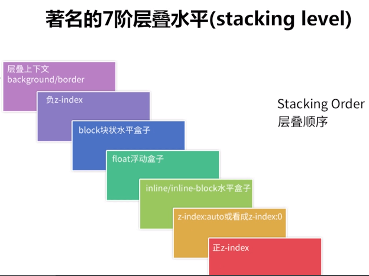

# 定位

`position` 属性指定了元素（标签）的定位类型。使得元素可以定位在页面任意位置。

`position` 属性的五个值：

- `static`   静态定位
- `relative` 相对定位
- `absolute` 绝对定位
- `fixed`    固定定位
- `sticky`   粘性定位

由于定位属性`position`可以使得元素在页面上任意位置，所以它得有结合属性，在上下左右四个方向设置，达到移动元素位置
- `left`   左边
- `right`  右边
- `top`    上边
- `bottom` 下边

## static 静态定位

HTML 元素的默认定位属性，即没有定位，遵循正常的文档流对象。

静态定位的元素不会受到 `top`, `bottom`, `left`, `right`影响，也就是说，position的值是 static 静态定位的时候，设置left, right,
top, bottom 也不会生效，如下：


```html
<!-- 设置元素也不会移动位置，不生效 -->
<html>
  <head>
    <style>
      .div1 {
        top: 20px;
        left: 100px;
        width: 100px;
        height: 100px;
        background-color: #f00;
        margin-bottom: 20px;
      }
    </style>
  </head>
  <div class="div1"></div>
  <div>我是div容器</div>
</html>
```


## relative 相对定位

**相对于默认位置（即 static 时的位置）进行偏移，即相对定位的基点是元素默认位置 static。对象遵循常规文档流。**

```html
<html>
  <head>
    <style>
      .div2 {
        position: relative;
        top: 20px;
        left: 100px;
        width: 100px;
        height: 100px;
        background-color: #f00;
        margin-bottom: 20px;
      }
    </style>
  </head>
  <div class="div2"></div>
  <div>我是div容器</div>
</html>
```

- <b class="red">移动相对定位元素，但它原本所占的空间不会改变。</b>
- <b class="red">相对定位元素经常被用来作为绝对定位元素的容器块。</b>

## absolute 绝对定位

**相对于最近一个position值不为static的祖先元素进行定位，如果没有定位的祖先元素，则一直回溯到 html 元素。脱离文档流。**

```html
<div class="parent">
    <div>absolute 定位使元素的位置与文档流无关，因此不占据空间。</div>
    <div>absolute 定位的元素和其他元素重叠。</div>
    <div class="children"></div>
</div>
```

```cs
.parent {
  position: relative;
  width: 100%;
  height: 500px;
  border: 1px solid black;
}

.children {
  position: absolute;
  top: 0;
  left: 0;
  width: 100px;
  height: 100px;
  background-color: lavender;
}
```

**absolute 绝对定位使元素的位置与文档流无关(脱离文档流)，因此不占据空间。**

**absolute 绝对定位的元素和其他元素重叠。**

## fixed 固定定位

元素的位置相对于浏览器窗口是固定位置。

即使窗口是滚动的它也不会移动：

```html
<html>
  <head>
    <style>
      .fixedCon {
        position: relative;
        width: 100%;
        height: 10000px;
        background-color: pink;
      }

      .fixed {
        position: fixed;
        right: 0;
        top: 50%;
        transform: translateY(-50%);
        width: 100px;
        height: 100px;
        background-color: #000;
      }
    </style>
  </head>
  <body>
    <div class="fixedCon">
      <div class="fixed"></div>
    </div>
  </body>
</html>
```

Fixed定位使元素的位置与文档流无关，因此不占据空间。

Fixed定位的元素和其他元素重叠。

## sticky 粘性定位

sticky 英文字面意思是粘，粘贴，所以可以把它称之为`粘性定位`。

`粘性定位`可以被认为是`相对定位`和`固定定位`的混合。元素在跨越特定阈值前为`相对定位`，之后为`固定定位`。

这个特定阈值指的是 `top`, `right`, `bottom` 或 `left` 之一，换言之，指定 `top,` `right`,`bottom` 或 `left` 四个阈值其中之一，才可使**粘性定位生效**。否则其行为与**相对定位相同**。

注意: Internet Explorer, Edge 15 及更早 IE 版本不支持 sticky 定位。 Safari 需要使用 `-webkit-sticky` (查看以下实例)。 

::: demo [vanilla]
```html
<html>

<head>
    <style>
        body,dl{
            margin: 0;
        }
        dt {
            position: -webkit-sticky;
            position: sticky;
            top: 0pX;
            background-color: #ccc;
        }
        dd {
            padding: 10px 0;
            white-space: nowrap;
        }
    </style>
</head>

<body>
    <div>
        <dl>
            <dt>A</dt>
            <dd>Andrew W.K.</dd>
            <dd>Apparat</dd>
            <dd>Arcade Fire</dd>
            <dd>At The Drive-In</dd>
            <dd>Aziz Ansari</dd>
        </dl>
        <dl>
            <dt>B</dt>
            <dd>B</dd>
            <dd>B</dd>
            <dd>B</dd>
            <dd>B B</dd>
            <dd>B</dd>
        </dl>
        <dl>
            <dt>C</dt>
            <dd>Chromeo</dd>
            <dd>Common</dd>
            <dd>Converge</dd>
            <dd>Crystal Castles</dd>
            <dd>Cursive</dd>
        </dl>
        <dl>
            <dt>D</dt>
            <dd>D</dd>
            <dd>D</dd>
            <dd>D</dd>
            <dd>D DDDDD</dd>
            <dd>D</dd>
        </dl>
        <dl>
            <dt>E</dt>
            <dd>Explosions In The Sky</dd>
            <dd>Explosions In The Sky</dd>
            <dd>Explosions In The Sky</dd>
            <dd>Explosions In The Sky</dd>
            <dd>Explosions In The Sky</dd>
        </dl>
        <dl>
            <dt>T</dt>
            <dd>Ted Leo & The Pharmacists</dd>
            <dd>T-Pain</dd>
            <dd>Thrice</dd>
            <dd>TV On The Radio</dd>
            <dd>Two Gallants</dd>
        </dl>
    </div>
</body>

</html>
```
:::

### 粘性定位sticky的用途

#### 导航的跟随定位效果

<br />
<iframe height="500" style="width: 100%;" scrolling="no" title="" src="https://codepen.io/347830076/embed/GRmgyvw?defaultTab=html%2Cresult" frameborder="no" loading="lazy" allowtransparency="true" allowfullscreen="true">
  See the Pen <a href="https://codepen.io/347830076/pen/GRmgyvw">
  </a> by cylyiou (<a href="https://codepen.io/347830076">@347830076</a>)
  on <a href="https://codepen.io">CodePen</a>.
</iframe>

#### 不超过一屏，显示在页面最底部，页面超过一屏，一直跟随在最后面
<br />
<iframe height="300" style="width: 100%;" scrolling="no" title="" src="https://codepen.io/347830076/embed/BaRyJOX?defaultTab=html%2Cresult" frameborder="no" loading="lazy" allowtransparency="true" allowfullscreen="true">
  See the Pen <a href="https://codepen.io/347830076/pen/BaRyJOX">
  </a> by cylyiou (<a href="https://codepen.io/347830076">@347830076</a>)
  on <a href="https://codepen.io">CodePen</a>.
</iframe>

<iframe height="300" style="width: 100%;" scrolling="no" title="sticky跟随底部2" src="https://codepen.io/347830076/embed/VwbYyEG?defaultTab=html%2Cresult" frameborder="no" loading="lazy" allowtransparency="true" allowfullscreen="true">
  See the Pen <a href="https://codepen.io/347830076/pen/VwbYyEG">
  sticky跟随底部2</a> by cylyiou (<a href="https://codepen.io/347830076">@347830076</a>)
  on <a href="https://codepen.io">CodePen</a>.
</iframe>

**这里注意，得给页面设置高度100%, 而且使用`top: 100%;`。**

使用 `bottom: 0;`的话，是达不到这样效果的

#### 元素滚动条内的粘性定位

<iframe height="300" style="width: 100%;" scrolling="no" title="Untitled" src="https://codepen.io/347830076/embed/KKvGqwO?default-tab=html%2Cresult" frameborder="no" loading="lazy" allowtransparency="true" allowfullscreen="true">
  See the Pen <a href="https://codepen.io/347830076/pen/KKvGqwO">
  Untitled</a> by cylyiou (<a href="https://codepen.io/347830076">@347830076</a>)
  on <a href="https://codepen.io">CodePen</a>.
</iframe>

## 定位属性

**定位属性只会在 position 值为非 static 的元素生效。**

### top

**定义了元素的上外边距边界与其包含块上边界之间的偏移**

- auto：默认值。通过浏览器计算上边缘的位置。
- %： 设置以包含元素的百分比计的上边位置。可使用负值。
- length： 使用 px、cm 等单位设置元素的上边位置。可使用负值。
- inherit： 规定应该从父元素继承 top 属性的值。

### bottom

**定义了元素的底外边距边界与其包含块底边界之间的偏移**

- auto：默认值。通过浏览器计算底部的位置。
- %： 设置以包含元素的百分比计的底边位置。可使用负值。
- length： 使用 px、cm 等单位设置元素的底边位置。可使用负值。
- inherit： 规定应该从父元素继承 bottom 属性的值。

### left

**定义了元素的左外边距边界与其包含块左边界之间的偏移**

- auto：默认值。通过浏览器计算左边缘的位置。
- %： 设置以包含元素的百分比计的左边位置。可使用负值。
- length： 使用 px、cm 等单位设置元素的左边位置。可使用负值。
- inherit： 规定应该从父元素继承 left 属性的值。

### right

**定义了元素的右外边距边界与其包含块右边界之间的偏移**

- auto：默认值。通过浏览器计算右边缘的位置。
- %： 设置以包含元素的百分比计的右边位置。可使用负值。
- length： 使用 px、cm 等单位设置元素的左边位置。可使用负值。
- inherit： 规定应该从父元素继承 right 属性的值。

### 例子代码
::: demo [vanilla]
```html
<html>
  <head>
    <style>
      .main{
        position: relative;
        height: 500px;
      }
      .box {
        position: absolute;
        top: 50px;
        left: 50px;
        width: 100px;
        height: 100px;
        background-color: red;
      }

      .box1 {
        position: absolute;
        bottom: 50px;
        right: 50px;
        width: 100px;
        height: 100px;
        background-color: blue;
      }

      /*如果同时设置了top和bottom | left和right*/
      /*情况一：如果盒子的宽度和高度确定了，那么会忽略bottom | right*/
      .box2 {
        position: absolute;
        top: 150px;
        bottom: 150px;
        left: 80px;
        right: 80px;
        width: 100px;
        height: 100px;
        background-color: yellow;
      }

      /*情况二；如果盒子的宽度或者高度未指明，那么盒子的宽度或者高度就会拉到同时满足 top 和 bottom | left 和 right的条件。*/
      .box3 {
        position: absolute;
        top: 160px;
        bottom: 160px;
        left: 160px;
        right: 160px;
        background-color: green;
      }
    </style>
  </head>
  <body>
    <div class="main">
      <div class="box"></div>
      <div class="box1"></div>
      <div class="box2"></div>
      <div class="box3"></div>
  </div>
    
  </body>
</html>
```
:::

## 重叠的元素 z-index

元素的定位与文档流无关，所以它们可以覆盖页面上的其它元素

z-index属性指定了一个元素的堆叠顺序（哪个元素应该放在前面，或后面）

一个元素可以有正数或负数的堆叠顺序：

**该属性设置一个定位元素(position 为非 static)沿 z 轴的位置，z 轴定义为垂直延伸到显示区的轴。如果为正数，则离用户更近，为负数则表示离用户更远。**

### 属性值设置

- auto：默认。堆叠顺序与父元素相等。
- number：设置元素的堆叠顺序。
- inherit：规定应该从父元素继承 z-index 属性的值。

默认下，后面元素覆盖在前面元素之上，想要改变堆叠顺序问题，就设置`z-index`, 谁z-index的值大就在上面

## 层级关系




### 层叠上下文（background/border） < ( z-index 小于 0 ) < block块级盒子 < float浮动盒子 < inline / inline-block 盒子 < z-index:auto / z-index: 0  <  z-index 大于 0

- 1.设置了定位的元素的层级高于普通的block盒子或者inline-block
- 2.如果都设置了z-index, 则谁的z-index值越大，层级越高
- 3.如果父级的z-index较高，那么所有的子级元素都比父级元素低的元素层级高
- 4.z-index 可以设置负值

### 层叠上下文
  #### 产生条件
  - 1.根元素（默认创建层叠上下文，只有 HTML 根元素，这里你可以理解为 body 标签。它属于根层叠上下文元素，不需要任何 CSS 属性来触发。）
  - 2.设置z-index 不为auto时
  - 3.其他css属性，例如：opcity不为1时候  transfrom等
