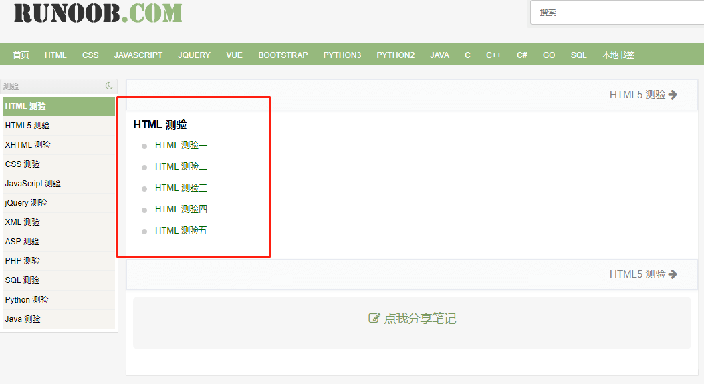
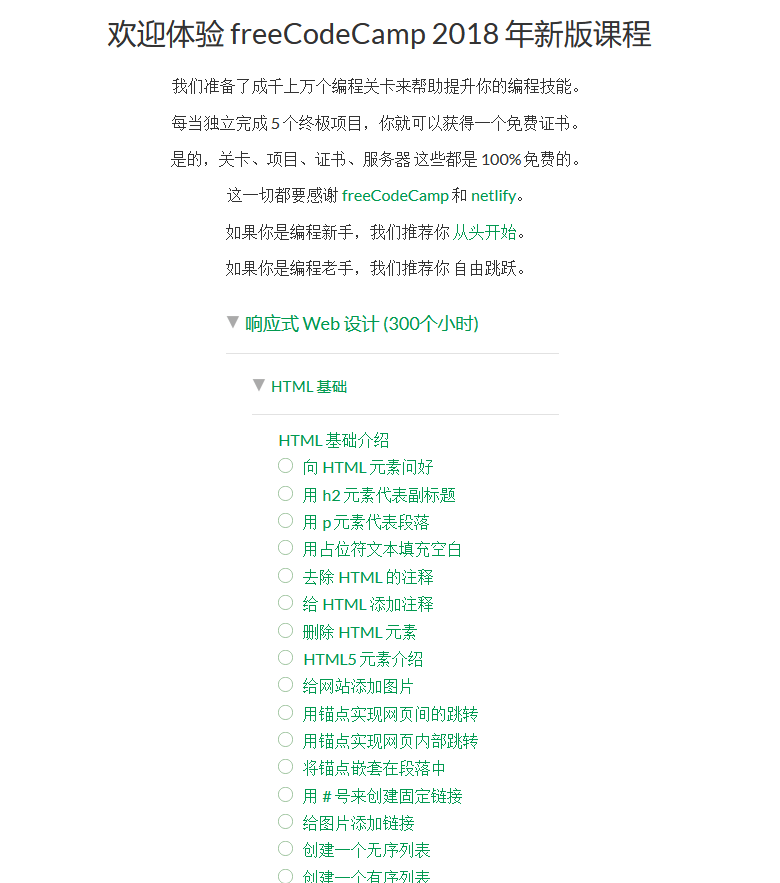

# html 测试

## 菜鸟html测试

### <a href="https://www.runoob.com/quiz/html-quiz.html" target="_blank" style="color:red">html 测试链接</a>

点击链接跳转到如下图：

大家把 html测验一 到 html测验五, 都做完。

## freecodecamp

FreeCodeCamp 是一个自由开源的学习编程的社区，致力于帮助人们利用零散时间学习编程。它的使命是 Learn to code and help nonprofits（学习编程，去帮助那些非盈利组织）。FCC 涵盖 HTML5、CSS、React、JavaScript、Database 等课程，游戏化程度非常高，学员可以通过线上聊天室和线下社区活动（Coffee and Code）相互帮助。目前覆盖全球 160+ 个国家、1000+ 个城市，40W+ 开发者在平台学习。

### 进阶练习

做完上面菜鸟html练习的同学， 可以继续进行刷题通关成为大神。

### <a href="https://learn.freecodecamp.one/" target="_blank" style="color:red">html 基础练习</a>

点击 html 基础练习 如下图：

大家先把 **freecodecamp** 的 **html基础介绍部分** 的题目刷了。

做完的同学们，恭喜你们html已经成功掌握了，为了之后的css打下了扎实的基础。

有时间可以再多去看看html教程，或者预习下css。
