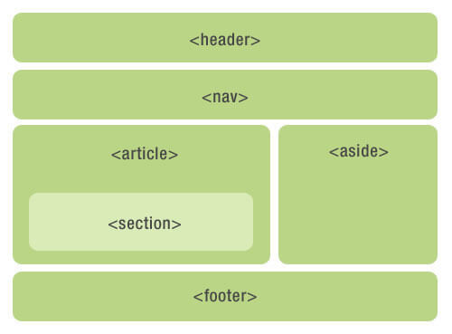

# HTML5 语义元素

语义= 意义

语义元素 = 有意义的元素

一个语义元素能够清楚的描述其意义给浏览器和开发者。

无语义 元素实例: `<div>` 和 `<span>` - 无需考虑内容.

语义元素实例: `<form>`, `<table>`, and `` - 清楚的定义了它的内容.

## HTML5中新的语义元素

许多现有网站都包含以下HTML代码： `<div id="nav">`, `<div class="header">`, 或者 `<div id="footer">`, 来指明导航链接, 头部, 以及尾部.

HTML5 提供了新的语义元素来明确一个Web页面的不同部分:

```js
<header>头部</header>
<nav>导航栏</nav>
<section>章节</section>
<article>文章</article>
<aside>在旁边</aside>
<figcaption>图表描述</figcaption>
<figure></figure>
<footer>尾部</footer>
```



## HTML5 &lt;section&gt; 元素

`<section>` 标签定义文档中的节（section、区段）。比如章节、页眉、页脚或文档中的其他部分。

根据W3C HTML5文档: section 包含了一组内容及其标题。

```html
<section>
  <h1>WWF</h1>
  <p>The World Wide Fund for Nature (WWF) is....</p>
</section>
```

## HTML5 &lt;article&gt; 元素

`<article>` 标签定义独立的内容。

```html
<article>
  <h1>Internet Explorer 9</h1>
  <p>Windows Internet Explorer 9(缩写为 IE9 )在2011年3月14日21:00 发布。</p>
</article>
```

## HTML5 &lt;nav&gt; 元素

`<nav>` 标签定义导航链接的部分。

`<nav>` 元素用于定义页面的导航链接部分区域，但是，不是所有的链接都需要包含在 `<nav>` 元素中! 

```html
<nav>
    <a href="/html/">HTML</a> |
    <a href="/css/">CSS</a> |
    <a href="/js/">JavaScript</a> |
</nav>
```

## HTML5 &lt;aside&gt; 元素

`<aside>` 标签定义页面主区域内容之外的内容（比如侧边栏）。

aside 标签的内容应与主区域的内容相关.

```html
<p>My family and I visited The Epcot center this summer.</p>

<aside>
  <h4>Epcot Center</h4>
  <p>The Epcot Center is a theme park in Disney World, Florida.</p>
</aside>
```

## HTML5 &lt;header&gt; 元素

`<header>`元素描述了文档的头部区域

`<header>`元素主要用于定义内容的介绍展示区域.

在页面中你可以使用多个`<header>` 元素.

以下实例定义了文章的头部:

```html
<article>
  <header>
    <h1>Internet Explorer 9</h1>
    <p><time pubdate datetime="2011-03-15"></time></p>
  </header>
  <p>Windows Internet Explorer 9(缩写为 IE9 )是在2011年3月14日21:00发布的</p>
</article>
```

## HTML5 &lt;footer&gt; 元素

`<footer>` 元素描述了文档的底部区域.

`<footer>` 元素应该包含它的包含元素

一个页脚通常包含文档的作者，著作权信息，链接的使用条款，联系信息等

文档中你可以使用多个 `<footer>`元素.

```html
<footer>
  <p>Posted by: Hege Refsnes</p>
  <p><time pubdate datetime="2012-03-01"></time></p>
</footer>
```
## HTML5 &lt;figure&gt; &lt;figcaption&gt; 元素

`<figure>`标签规定独立的流内容（图像、图表、照片、代码等等）。

`<figure>` 元素的内容应该与主内容相关，但如果被删除，则不应对文档流产生影响。

`<figcaption>` 标签定义 `<figure>` 元素的标题.

`<figcaption>`元素应该被置于 "figure" 元素的第一个或最后一个子元素的位置。

```html
<figure>
  
  <figcaption>Fig1. - The Pulpit Pock, Norway.</figcaption>
</figure>
```

### 我们可以开始使用这些语义元素吗?

以上的元素都是块元素(除了`<figcaption>`).

为了让这些块及元素在所有版本的浏览器中生效，你需要在样式表文件中设置一下属性 (以下样式代码可以让旧版本浏览器支持本章介绍的块级元素):

```html
header, section, footer, aside, nav, article, figure
{
    display: block;
} 
```

### Internet Explorer 8 及更早IE版本中的问题

IE8 及更早IE版本无法在这些元素中渲染CSS效果，以至于你不能使用 `<header>`, `<section>`, `<footer>`, `<aside>`, `<nav>`, `<article>`, `<figure>`, 或者其他的HTML5 elements.

解决办法: 你可以使用HTML5 Shiv Javascript脚本来解决IE的兼容问题。HTML5 Shiv下载地址：<a href="https://cdn.static.runoob.com/libs/html5shiv/3.7/html5shiv.min.js" target="_blank">https://cdn.static.runoob.com/libs/html5shiv/3.7/html5shiv.min.js</a>

下载后，将以下代码放入到网页中：

```html
<!--[if lt IE 9]>
<script src="html5shiv.js"></script>
<![endif]--> 
```

以上代码在浏览器小于IE9版本时会加载html5shiv.js文件. 你必须将其放置于`<head>` 元素中，因为 IE浏览器需要在头部加载后渲染这些HTML5的新元素

[更多HTML5教程](https://www.runoob.com/html/html5-intro.html)

### html 参考手册

<a href="https://www.w3school.com.cn/tags/index.asp"> w3school html标签手册 </a>

<a href="https://www.runoob.com/tags/html-reference.html"> 菜鸟教程 html标签手册 </a>


