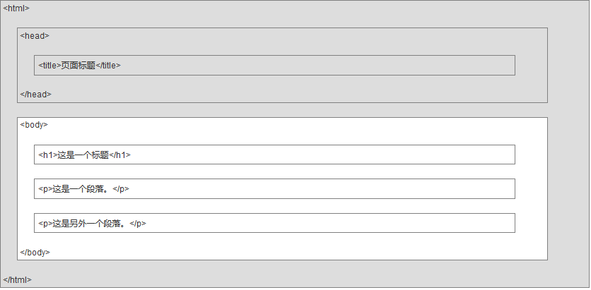
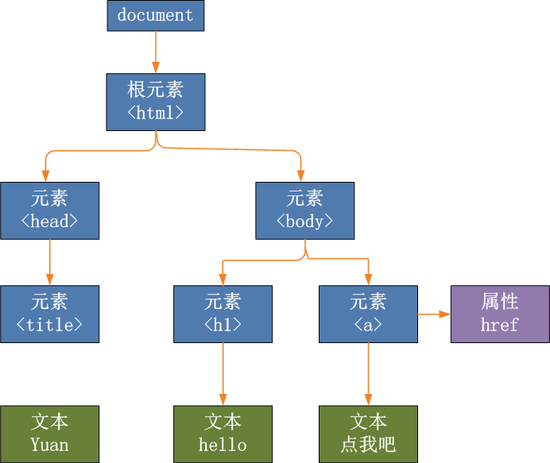
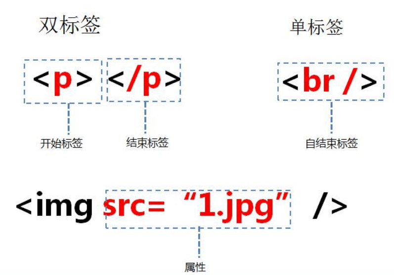

# html介绍和结构分析

## 什么是 HTML？

HTML 是用来描述网页的一种语言。

HTML 是一种<b>超文本标记语言</b> (Hyper Text Markup Language)  Hypertext是指超文本语言(文本 + 图片 + 视频 + 音频 + 链接)；Markup是标记

因为网页是构成网站的基本元素，而网页通常由图片、链接、文字、声音、视频等元素组成的，不单单只是文本，所以叫做超文本标记语言。

HTML 不是一种编程语言，而是<b>一种标记语言</b> (markup language)

标记语言是有一套<b>标记标签</b> (markup tag)的

HTML 是使用<b>标记标签</b>来描述网页

## HTML 文档 = 网页

HTML 文档包含 **HTML 标签**和**纯文本**

HTML 文档也被称为**网页**

请注意HTML是专门写给浏览器始别的语言，然后浏览器在转换渲染成图像给我们看。

Web 浏览器的作用是读取 HTML 文档，并以网页的形式显示出它们。浏览器不会显示 HTML 标签，而是使用标签来解释页面的内容


**大多数 HTML 元素可以互相嵌套的**


### html 基本结构代码
```html
<!DOCTYPE html>
<html>
    <head>
        <meta charset="utf-8">
        <title></title>
    </head>
    <body>
        <h1>我的第一个标题</h1>
        <p>我的第一个段落。</p>
    </body>
</html>
```

### 结构代码分析

`<!DOCTYPE html>` 声明为 HTML5 文档

`<html>` 元素是 HTML 页面的根元素

`<head>` 元素包含了文档的元（meta）数据，如 `<meta charset="utf-8">` 定义网页编码格式为 utf-8。

`<title>` 元素描述了文档的标题

`<body>` 元素包含了可见的页面内容

`<h1>` 元素定义一个大标题

`<p>` 元素定义一个段落


## HTML版本

从初期的网络诞生后，已经出现了许多HTML版本:

|版本| 	发布时间|
| ----      | ---- |
|HTML 	    | 1991 |
|HTML+ 	    | 1993 |
|HTML 2.0 	| 1995 |
|HTML 3.2 	| 1997 |
|HTML 4.01 	| 1999 |
|XHTML 1.0 	| 2000 |
|HTML5 	    | 2012 |
|XHTML5 	| 2013 |

## HTML 网页结构

下面是一个可视化的HTML页面结构：



<b>只有 `<body>` 区域 (白色部分)才会在浏览器中显示。</b>

### HTML树状图 (DOM 树)
<p></p>


### 标签

HTML 标记标签通常被称为 HTML 标签 (HTML tag)。

HTML 标签是由尖括号包围的关键词，比如 `<html>`

HTML 标签通常是**成对出现**的，比如 `<div>` 和 `</div>`

标签对中的第一个标签是**开始标签**，第二个标签是**结束标签**

开始和结束标签也被称为**开放标签**和**闭合标签**

HTML 标签有开始必须有结束。如果是没有内容的标签（空标签），用 />来结束。

标签名推荐用小写。

标签具有属性， 属性用来表示标签的性质和特征。属性要在开始标签中指定




## HTML 元素

**HTML 标签** 和 **HTML 元素** 通常都是描述同样的意思.

## 定义一个合格的HTML页面

### 1. <!DOCTYPE> 声明

<!DOCTYPE>声明有助于浏览器中正确显示网页。

网络上有很多不同的文件，如果能够正确声明HTML的版本，浏览器就能正确显示网页内容。

doctype 声明是不区分大小写的，以下方式均可： 

```html
<!DOCTYPE html>

<!DOCTYPE HTML>

<!doctype html>

<!Doctype Html> 
```

#### 通用声明

**HTML5**
```html
<!DOCTYPE html> 
**HTML 4.01**
```html
<!DOCTYPE HTML PUBLIC "-//W3C//DTD HTML 4.01 Transitional//EN"
"http://www.w3.org/TR/html4/loose.dtd">
```

查看更多完整网页声明类型 <a href="https://www.runoob.com/tags/tag-doctype.html">DOCTYPE 参考手册</a>。

现在新时代的你们，只需要用 `<!DOCTYPE html> ` 就可以通用了。

### 页面头部  &lt;head&gt; 元素

`<head>`元素包含了所有的头部标签元素。在 `<head>`元素中你可以插入脚本（scripts）, 样式文件（CSS），及各种meta信息。

可以添加在头部区域的元素标签为: `<title>`, `<style>`, `<meta>`, `<link>`, `<script>`

### 设置页面标题 &lt;title&gt;
```html
<title>标题</title>
```

### 设置页面编码
目前在大部分浏览器中，直接输出中文会出现中文乱码的情况，这时候我们就需要在头部将字符声明为 UTF-8 或 GBK。

```html
<meta charset="utf-8">
```
说明：

`utf-8`	  多国语言编码

`gb2312`   中文简体编码


### 设置页面关键字，描述内容介绍

```html
<meta name="keywords" content="关键字1，关键字2，…" />
<meta name="description" content="描述内容介绍" />
```

### 页面内容 &lt;body&gt; 元素

```html
<body></body>
```

我们的内容代码，主要放body标签里面