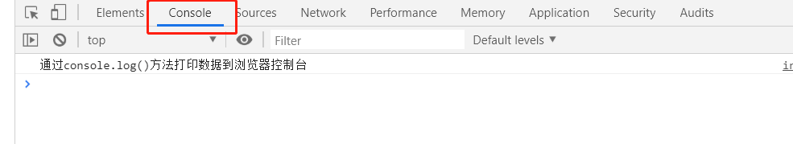

# JavaScript 调试

在编写 JavaScript 时，如果没有调试工具将是一件很痛苦的事情。

你的代码可能包含语法错误，逻辑错误，如果没有调试工具，这些错误比较难于发现。

通常，如果 JavaScript 出现错误，是不会有提示信息，这样你就无法找到代码错误的位置。

## JavaScript 调试工具

在程序代码中寻找错误叫做代码调试。

调试很难，但幸运的是，很多浏览器都内置了调试工具。

内置的调试工具可以开始或关闭，严重的错误信息会发送给用户。

有了调试工具，我们就可以设置断点 (代码停止执行的位置), 且可以在代码执行时检测变量。

浏览器启用调试工具一般是按下 F12 键，并在调试菜单中选择 "Console" 。



## console.log() 方法

如果浏览器支持调试，你可以使用 console.log() 方法在调试窗口上打印 JavaScript 值：

```js
var a = 5;
var b = 6;
var c = a + b;
console.log(a, b, c);
```

## 设置断点

在调试窗口中，你可以设置 JavaScript 代码的断点。

在每个断点上，都会停止执行 JavaScript 代码，以便于我们检查 JavaScript 变量的值。

在检查完毕后，可以重新执行代码（如播放按钮）

## debugger 关键字

debugger 关键字用于停止执行 JavaScript，并调用调试函数。

这个关键字与在调试工具中设置断点的效果是一样的。

如果没有调试可用，debugger 语句将无法工作。

## 错误捕捉 try/catch/finally

### JavaScript 错误

当 JavaScript 引擎执行 JavaScript 代码时，会发生各种错误。

可能是语法错误，通常是程序员造成的编码错误或错别字。

可能是拼写错误或语言中缺少的功能（可能由于浏览器差异）。

可能是由于来自服务器或用户的错误输出而导致的错误。

当然，也可能是由于许多其他不可预知的因素。

### 定义和用法
`try/catch/finally` 语句用于处理代码中可能出现的错误信息。

`try` 语句允许我们定义在执行时进行错误测试的代码块。

`catch` 语句允许我们定义当 `try` 代码块发生错误时，所执行的代码块。

`finally` 语句在 `try` 和 `catch` 之后无论有无异常都会执行。

**注意： catch 和 finally 语句都是可选的，但你在使用 try 语句时必须至少使用一个。**

> 提示： 当错误发生时， JavaScript 会停止执行，并生成一个错误信息。使用 throw 语句 来创建自定义消息(抛出异常)。如果你将 throw 和 try 、 catch一起使用，就可以控制程序输出的错误信息。

### 语法
```js
    try {
        tryCode - 尝试执行代码块
    }
    catch(err) {
        catchCode - 捕获错误的代码块
    }
    finally {
        finallyCode - 无论 try / catch 结果如何都会执行的代码块
    }
```

实例

```js
    try {
        adddlert("欢迎光临！");
    }
    catch(err) {
        console.log(err);
        console.log(err.message);
    }
    finally {
        console.log('不管是否报错我都会执行');
    }
```

在上面的例子中，我们故意在 try 块的代码中写了一个错字。

该实例本应该提醒"欢迎光临！"，但弹出的是拼写错误信息。

catch 块会捕捉到 try 块中的错误，并执行代码来处理它

自定义错误实例

```js
<p>请输入 5 和 10 之间的一个数:</p>
 
<input id="demo" type="text">
<button type="button" onclick="myFunction()">检测输入</button>
<p id="message"></p>
 
<script>
    function myFunction() {
        let message, x;
        message = document.getElementById("message");
        message.innerHTML = "";
        x = document.getElementById("demo").value;
        try {
            if (x == "") {
                throw "不能为空";
            }
            if (isNaN(x)) {
                throw "不是一个数字";
            }
            if (x > 10) {
                throw "太大了";
            }
            if (x < 5) {
                throw "太小了";
            }
            throw "正确";
        } catch (err) {
            message.innerHTML = "输入的值 " + err;
        }
    }
</script>
```
该实例检测输入的值是否错误，如果错误则抛出异常。

异常通过 catch 语句捕获，并输出自定义信息

## 主要浏览器的调试工具

<b>通常，浏览器启用调试工具一般是按下 F12 键，并在调试菜单中选择 "Console" 。</b>

### Chrome 浏览器  谷歌浏览器

**方法一**

打开浏览器。

在菜单中选择 "更多工具"。

在 "更多工具" 中选择 "开发者工具"。

最后，选择 Console。

**方法二**

打开浏览器。

右击鼠标，选择 "检查"。

### Firefox 浏览器

打开浏览器。

右击鼠标，选择 "查看元素"。

### Safari

打开浏览器。

右击鼠标，选择检查元素。

在底部弹出的窗口中选择"控制台"。

### Internet Explorer 浏览器。
打开浏览器。

在菜单中选择工具。

在工具中选择开发者工具。

最后，选择 Console。

### Opera

打开浏览器。

点击左上角，选择"开发者工具",选择"WEB检查器"。


